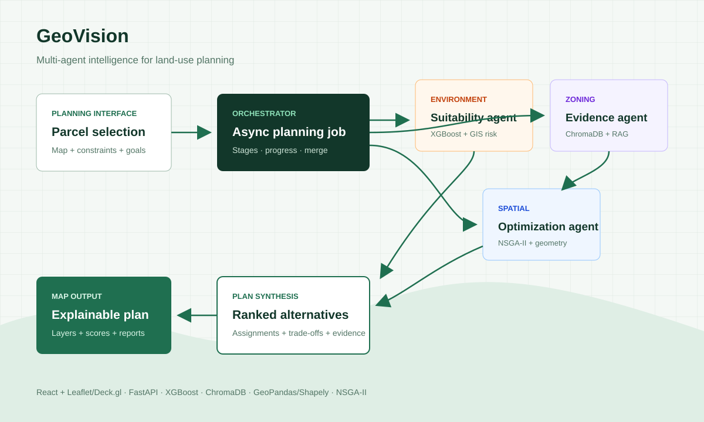

<!-- markdownlint-disable MD001 MD013 MD033 MD041 -->
<div align="center">

# GeoVision

### Multi-agent geospatial intelligence for explainable land-use planning

[Live product](https://geovision-eight-pi-72.vercel.app) ·
[Portfolio](https://relinxx.vercel.app/projects/geovision) ·
[Architecture](docs/architecture.svg)


</div>

GeoVision is a map-centric planning system that combines environmental
suitability, zoning evidence, and multi-objective spatial optimization in one
explainable workflow. A user selects parcels, defines planning constraints, and
receives alternative land-use plans with scores, assignments, and supporting
regulatory context.

The project was built as a final-year Software Engineering capstone at FAST
University. It treats AI as a coordinated decision system rather than a single
prediction endpoint.

## Product workflow

1. Select parcels and planning constraints on an interactive map.
2. Score environmental suitability with an XGBoost-backed agent.
3. Retrieve zoning context from a regulation-focused RAG service.
4. Merge environmental and regulatory signals.
5. Run NSGA-II spatial optimization to generate alternative plans.
6. Compare assignments, objective trade-offs, risks, and explanations.

## Architecture



GeoVision separates domain reasoning into focused agents:

| Agent | Responsibility | Core approach |
| --- | --- | --- |
| Environment | Estimate parcel suitability and risk | XGBoost, engineered GIS features |
| Zoning | Retrieve relevant planning constraints | ChromaDB, embeddings, RAG |
| Spatial | Produce feasible land-use assignments | GeoPandas, Shapely, NSGA-II |
| Orchestrator | Coordinate stages and job progress | FastAPI, async job lifecycle |

The React interface consumes the merged result and renders parcel selections,
plan alternatives, zoning answers, and generated map layers.

## Engineering highlights

- Asynchronous multi-stage orchestration with status and result endpoints
- Environmental suitability scoring over geospatial parcel features
- Regulation-grounded zoning retrieval with source context
- Multi-objective spatial optimization using NSGA-II
- Geometry generation and validation with GeoPandas and Shapely
- Authentication, saved maps, planner settings, and report generation
- Map rendering with Leaflet and Deck.gl
- Focused unit and endpoint tests across agents and orchestration

## Planning pipeline

```text
Parcel selection + constraints
  -> Environment suitability
  -> Zoning evidence retrieval
  -> Signal merge
  -> Spatial optimization
  -> Ranked plan alternatives
  -> Interactive map + explanation
```

The optimizer can balance competing objectives instead of collapsing every
decision into one opaque score. This makes trade-offs visible to planners and
supports comparison between feasible alternatives.

## Repository structure

```text
.
|-- backend/
|   |-- agent/
|   |   |-- environment_agent/   # Suitability and risk scoring
|   |   |-- zoning_agent/        # Regulation retrieval and answers
|   |   `-- spatial_agent/       # Geometry and NSGA-II optimization
|   |-- routers/                  # Auth, orchestration, maps, spatial APIs
|   |-- services/                 # Job lifecycle and domain services
|   `-- main.py                   # FastAPI application
|-- frontend/
|   `-- src/                      # React map and planning experience
|-- tests_all/                    # Unit and endpoint coverage
|-- docs/architecture.svg
|-- docker-compose.yml
`-- README.md
```

## Run locally

### Backend

```powershell
cd backend
python -m venv .venv
.\.venv\Scripts\Activate.ps1
python -m pip install -r requirements.txt
python -m uvicorn main:app --reload
```

Create backend environment variables for the services you enable:

```env
JWT_SECRET_KEY=replace_me
OPENAI_API_KEY=optional_for_zoning_rag
RAG_PERSIST_DIR=path_to_local_vector_store
```

### Frontend

```powershell
cd frontend
npm install
Copy-Item .env.example .env.local
npm run dev
```

The frontend uses `VITE_API_URL` to locate the FastAPI service.

## Data and security

Large GIS datasets, model binaries, vector stores, generated reports, and local
environment files are intentionally excluded from this public repository. The
source shows the system design and implementation without publishing private
credentials or bulky derived artifacts.

To reproduce the full environmental pipeline, provide compatible parcel and
hazard layers locally and train or supply the suitability model referenced by
the environment agent.

## Verification

Frontend:

```powershell
cd frontend
npm run build
```

Backend:

```powershell
cd backend
python -m pytest ..\tests_all
```

The repository includes tests for orchestration stages, zoning retrieval,
spatial compatibility, saved maps, authentication, and API contracts.

## Technical direction

GeoVision is a late-stage prototype intended to demonstrate applied AI systems
engineering. A production deployment would move job state to Redis, execute
long-running optimization through distributed workers, version GIS datasets,
and add formal evaluation for retrieval quality and planning outcomes.

## Author

Built by [Syed Muhammad Rehan](https://www.linkedin.com/in/relinxx), an
AI-focused software engineer working on multi-agent systems, RAG, geospatial
software, and production backend services.
